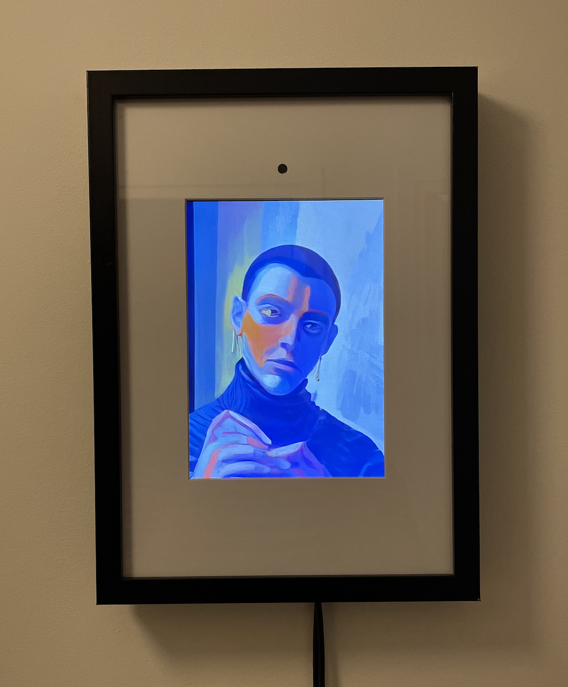

# PabloNet

## Overview

<div class="image-container" style="flex: 1; text-align: left">
    
</div>

PabloNet is a real-time AI art frame consisting of a display with an integrated camera that performs diffusion on captured images through a remote GPU server. For purchasing information, please visit the [blogpost](https://mlecauchois.github.io/posts/pablonet/). You can also make one yourself by following the recipe at the end of this page.

## Quick Start Guide

Complete setup should take under 20 minutes.

### Device SSH access

Upon receiving a device:
- The device comes pre-configured with an access point named `pablonet`. Connect to this AP using default temporary password `pablonet`.
- SSH into the device with default temporary password `pi1234` (change that password after successfully connecting):
```bash
ssh pi@raspberrypi.local
```
- Connect the device to your local WiFi network to enable internet access:
```bash
sudo nmcli device wifi connect "Your_Internet_SSID" password "Your_Password" ifname wlan1
```
- From now on, you can SSH into the device both from the device's AP or your WiFi.
- Test internet access on the device:
```bash
ping google.com
```
- Note that even if you are connected to the AP, you will have internet access on your computer through the device. However, it will be slower than connecting directly to your WiFi network.

### GPU server setup

Currently, the device is not able to do inference. A non-distilled Stable Diffusion is used under the hood which would not be able to run on a Pi. Until the model is distilled and a Jetson is added to future devices, it is necessary to setup a remote GPU server.

**Custom Deployment**

A simple Docker image is released containing all the required packages and code: [matthieulc/pablonet:latest](https://hub.docker.com/r/matthieulc/pablonet). You can use the container serving service of your choice.

**RunPod Deployment**

Here are the steps to setup a server on [RunPod](https://www.runpod.io/) specifically, which should be doable in under 10 minutes. In case you are new to RunPod, I recorded a small video tutorial [here](https://youtu.be/aw6C6D4pC9c).

- Add your SSH public key to access your pods (tutorial [here](https://docs.runpod.io/pods/configuration/use-ssh)).
- Create a persistent storage volume in order to cache the TensorRT engine, which is GPU-specific.
- Deploy a new pod for this volume with the following template (a public template for PabloNet is also made available [here](https://runpod.io/console/deploy?template=d3d1n13nhd&ref=hftrdy9e)):
    - GPU: RTX 4090 (recommended).
    - Volume: Mount your persistent storage at `/pablonet/engines`.
    - Docker Image: [matthieulc/pablonet:latest](https://hub.docker.com/r/matthieulc/pablonet).
    - Exposed Ports: 22 for SSH and 6000 for the backend.
    
- Access the pod:
```bash
ssh -p <pod_ssh_port> root@ssh.runpod.io
```
- Activate the virtual environment:
```bash
source /pablonet/venv/bin/activate
```
- Launch the server with the default parameters, which should then be accessible at `ws://IP:6000`:
```bash
python /pablonet/server.py --base_model_path "Lykon/DreamShaper" \
                           --acceleration "tensorrt" \
                           --prompt "" \
                           --num_inference_steps 30 \
                           --guidance_scale 1.0 \
                           --t_index_list "[14,18]" \
                           --preprocessing canny_blur_shift \
                           --jpeg_quality 80 \
                           --port 6000 \
                           --engines_dir "/pablonet/engines"
```

Note: The container's entrypoint script handles SSH setup and environment configuration automatically.

### Device setup

SSH into your device after following the internet access steps above:
```bash
ssh pi@raspberrypi.local
```

Launch the client wth the default parameters:
```bash
python pablonet/client_pi.py --prompt "painting in the style of pablo picasso, cubism, sharp high quality painting, oil painting, mute colors red yellow orange, background of green, color explosion, abstract surrealism" \
                             --image_size 150 \
                             --url ws://URL \
                             --fullscreen \
                             --crop_size 900 \
                             --crop_offset_y 40 \
                             --jpeg_quality 70 \
                             --rotation 270 \
                             --target_fps 4
```

The client should take ~30s to start.

### Performance

With an RTX 4090 GPU and a good internet connection, these are the FPS ranges you should get:
- Server side FPS: 15-25
- Device FPS: 2-9

Below these FPS, the quality of the experience will be degraded and you should investigate potential network latency issues, or improper GPU setup. Typically, you should make sure that the TensorRT engine is properly re-compiled for your GPU.

### Debugging

You can setup a client on your computer using your webcam to make debugging the server easier:

```bash
python pablonet/client.py --prompt "painting in the style of pablo picasso, cubism, sharp high quality painting, oil painting, mute colors red yellow orange, background of green, color explosion, abstract surrealism" \
                          --image_size 150 \
                          --url ws://URL \
                          --jpeg_quality 70 \
                          --target_fps 4
```

Make sure the power brick you use supplies enough power for both the Pi and screen, otherwise the device might not be able to boot up:
- Pi power supply requirements: 5 V 2.5 A
- Screen power supply requirements: 5 V 2 A

If you are connected to the Pi's network but sshing to the Pi via `ssh pi@raspberrypi.local` does not work, try rebooting it. Else, find out its IP adress via something like:
```bash
nmap -sn 192.168.1.0/24 
```

## Building Your Own Device

Since the current device does not run inference, it is very minimal. The main thing is to make it clean enough to look like a normal frame.

### Part list

Purchased parts:
- [Raspberry Pi Zero 2 W](https://www.amazon.fr/dp/B09KLVX4RT)
- [10.1" Pi screen](https://www.amazon.fr/HMTECH-Raspberry-Moniteur-portable-Raspbian/dp/B098762GVK)
- [Black frame with enough depth to fit the electronics](https://www.leroymerlin.fr/produits/decoration-eclairage/decoration-murale/cadre-photo/cadre-noir/cadre-milo-21-x-29-7-cm-noir-inspire-71670942.html)
- [Infrared Pi camera for in-the-dark visuals](https://www.kubii.com/en/cameras-sensors/3879-1691-infrared-camera-module-v3-raspberry-pi-3272496313682.html#/angle-standard_75)
- [Infrared light for in-the-dark visuals](https://www.amazon.fr/dp/B0BG5HM2Q8)
- [WiFi dongle](https://www.amazon.fr/dp/B008IFXQFU)
- [USB to Micro USB adapter for WiFi dongle](https://www.amazon.fr/dp/B09CV12BBZ)
- [Thin HDMI-HDMI cable](https://www.amazon.fr/dp/B09LS9LS24)
- [HDMI to mini HDMI adapter](https://www.amazon.fr/dp/B00ESXN4IK)
- [Micro USB Y splitter](https://www.amazon.fr/dp/B08T7MCMWT)
- [2m USB extension cord](https://www.amazon.fr/dp/B00WHZ7AGS)
- [Inserts for 3D printed parts](https://www.amazon.fr/dp/B0CS6YVJYD&th=1)
- [Raspberry Pi Zero 2 W heatsink](https://www.amazon.fr/dp/B09QMBCXLB)

Special tools:
- [Large-depth cardboard puncher for the camera hole](https://www.amazon.fr/dp/B0BHQSL4PL)

Custom parts:
- Top mount 3D printed. STEP file located at `hardware/top_mount.step`
- Bottom mount 3D printed. STEP file located at `hardware/bottom_mount.step`
- Back panel laser cut in acrylic. DXF file located at `hardware/back_panel.dxf`


<p>
  
  
</p>


You will need M2.5 screws and nuts for everything, except for the camera mounting which requires M2 screws and nuts. You will also need a soldering iron to fit the threaded inserts.

Note: these custom parts are overfitted to the frame, Pi, screen and camera I chose. However it should be straightforward to adapt them for other sets of parts.

### Assembly

### Setting up a new Pi

Flash Raspbian Bookworm to SD card and make sure to:
- Configure hostname
- Configure user and password
- Enable SSH
- Set up WiFi credentials

You can then power up the Pi with the flashed SD card.

Next you will need to setup rotation of the screen at boot. First note the name of the display by running: 
```bash
wlr-randr
```

Create or edit the autostart configuration file:

```bash
sudo mkdir -p /etc/xdg/autostart
sudo nano /etc/xdg/autostart/screen-rotation.desktop
```

Add these lines to the file:
```bash
[Desktop Entry]
Type=Application
Name=Screen Rotation
Exec=wlr-randr --output YOUR_DISPLAY_NAME --transform 90
Terminal=false
Hidden=false
X-GNOME-Autostart-enabled=true
```

Make the file executable:

```bash
sudo chmod +x /etc/xdg/autostart/screen-rotation.desktop
```

Next, we have to hide the cursor since we will be running the device in a kiosk mode. Sadly, I found no solutions worked for the newer Labwc window manager that ships with Bookworm, so I used this dirty but reversible trick that makes the cursor invisible:

```bash
# Backup the original cursors
sudo mv /usr/share/icons/PiXflat/cursors/left_ptr /usr/share/icons/PiXflat/cursors/left_ptr.bak
sudo mv /usr/share/icons/Adwaita/cursors/left_ptr /usr/share/icons/Adwaita/cursors/left_ptr.bak

# Download an invisible cursor
mkdir -p ~/.icons/inviscursor-theme/cursors
wget -O ~/.icons/inviscursor-theme/cursors/left_ptr https://raw.githubusercontent.com/gysi/ubuntu-invis-cursor-theme/main/inviscursor-theme/cursors/left_ptr

# Move them to default cursor location
sudo cp ~/.icons/inviscursor-theme/cursors/left_ptr /usr/share/icons/PiXflat/cursors/left_ptr
sudo cp ~/.icons/inviscursor-theme/cursors/left_ptr /usr/share/icons/Adwaita/cursors/left_ptr

sudo reboot
```

### Setting up the Pi as an Access Point

Upon recepetion of a device, the user will not be able to SSH into it since the device will not be connected to the local network. To make the device initially controllable without a mouse, keyboard nor touchscreen, we will make it an AP to which we can connect. We will then be able to SSH into the device.

The Pi used has a unique wireless network interface, so if we want it to be able to both act as an AP and as a client, we need to add another. That's where the dongle comes in, which is connected to the USB port. However it can't act as an AP, so we need to use it as client, and use the original Pi interface as AP.

```bash
sudo apt update
sudo apt install network-manager

# List the interfaces, generally wlan0 is the original and wlan1 the dongle
nmcli device status

# Set up the AP on wlan0
sudo nmcli connection add type wifi ifname wlan0 con-name pablonet autoconnect yes ssid "pablonet"
sudo nmcli connection modify pablonet 802-11-wireless.mode ap
sudo nmcli connection modify pablonet 802-11-wireless.band bg
sudo nmcli connection modify pablonet 802-11-wireless.channel 6
sudo nmcli connection modify pablonet 802-11-wireless-security.key-mgmt wpa-psk
sudo nmcli connection modify pablonet 802-11-wireless-security.proto rsn
sudo nmcli connection modify pablonet 802-11-wireless-security.psk "pablonet"
sudo nmcli connection modify pablonet ipv4.method shared
sudo nmcli connection up pablonet

# Verify the connection is active
nmcli connection show --active

# Increase priority to maintain the AP on wlan0 at reboot
sudo nmcli connection modify pablonet connection.autoconnect-priority 100
```

### Setting up the client

```bash
sudo apt update
sudo apt upgrade

sudo apt install python3-pip python3-dev python3-tk python3-opencv python3-picamera2 libatlas-base-dev tk-dev python3-websockets python3-numpy python3-pillow

git clone https://github.com/mlecauchois/pablonet.git
```

## Disclaimer

Please see the [Disclaimer](DISCLAIMER.md) for legal information.